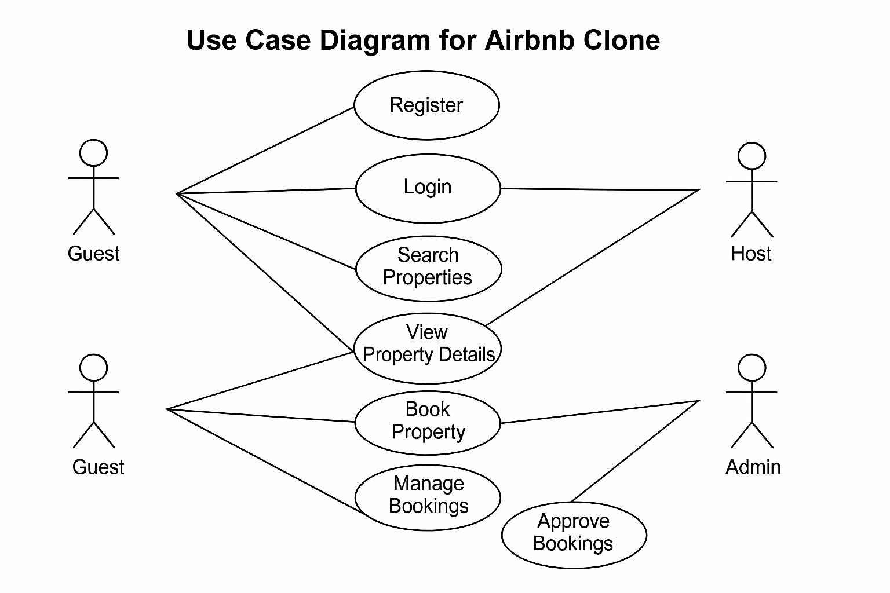

# Requirement Analysis in Software Development

## 📖 Introduction

Welcome to the **Requirement Analysis in Software Development** repository.  
This repository is created to document, explain, and visually represent the essential activities and deliverables involved in the **Requirement Analysis phase** of the **Software Development Lifecycle (SDLC)**.  

As part of this exercise, we’ll use a **Booking Management System** (Airbnb Clone) as a case study to demonstrate practical application of requirement analysis concepts.

---

## 📌 What is Requirement Analysis?

**Requirement Analysis** is a crucial phase in the **Software Development Lifecycle (SDLC)** where developers, stakeholders, and end-users collaborate to gather, analyze, and document the functional and non-functional requirements of a software system.

This phase ensures that:

- The software addresses business objectives and user needs.
- All functionalities and constraints are clearly understood before development begins.
- Project scope is well-defined, avoiding scope creep and misalignments.

---

## 📌 Why is Requirement Analysis Important?

Requirement Analysis is critical because:

1. **Defines Clear Project Scope:**  
   It prevents misunderstandings and scope changes during development by documenting detailed software expectations.

2. **Improves Communication:**  
   Acts as a contract between stakeholders and developers, aligning technical capabilities with business objectives.

3. **Reduces Development Costs and Time:**  
   Identifying problems early in the requirement phase reduces costly changes during or after development.

---

## 📌 Key Activities in Requirement Analysis

The Requirement Analysis phase typically involves these key activities:

- **Requirement Gathering:**  
  Collecting stakeholder needs via interviews, surveys, observations, and workshops.

- **Requirement Elicitation:**  
  Clarifying and refining gathered needs using techniques like brainstorming, prototyping, and use case development.

- **Requirement Documentation:**  
  Creating detailed documents like Software Requirement Specifications (SRS), user stories, and use case descriptions.

- **Requirement Analysis and Modeling:**  
  Structuring requirements through models, diagrams, and matrices to visualize system behavior and relationships.

- **Requirement Validation:**  
  Reviewing the documented requirements with stakeholders to confirm accuracy, feasibility, and completeness.

---

## 📌 Types of Requirements

### 🔹 Functional Requirements

Describe **what the system should do** — its features and behaviors.

**Examples for Booking Management System:**
- User can register and log in.
- User can search for properties.
- User can view property details.
- User can book a property.
- User can manage their bookings.

### 🔹 Non-functional Requirements

Describe **how the system should perform** — quality attributes, constraints, and performance metrics.

**Examples for Booking Management System:**
- The page should load within 2 seconds.
- The system should be available 99.9% of the time.
- User data should be encrypted and secured.
- The application should handle at least 10,000 concurrent users.

---

## 📌 Use Case Diagrams

**Use Case Diagrams** visually represent the interactions between actors (users or external systems) and the system’s functionalities.

**Benefits:**
- Clarifies system functionality.
- Enhances communication with stakeholders.
- Identifies user roles and system boundaries.

### 📊 Booking Management System Use Case Diagram

**Actors:**
- **Guest:** End-user booking and searching for properties.
- **Host:** User listing properties.
- **System:** The booking management platform.

**Use Cases:**
- Register
- Login
- Search Property
- View Property Details
- Book Property
- Cancel Booking
- Manage Bookings
- List Property

**Relationships:**
- Guest interacts with registration, login, search, booking, viewing, managing bookings.
- Host interacts with listing properties and managing them.
- The system manages property availability and booking confirmations.

---

## 📌 Acceptance Criteria

**Acceptance Criteria** are conditions that a feature or system must satisfy to be accepted by stakeholders.

**Importance:**
- Ensures each feature meets business needs.
- Acts as a checklist for developers and testers.
- Reduces ambiguity about feature expectations.

**Example: Checkout Feature Acceptance Criteria**
- User must be logged in to book a property.
- User must select available dates.
- The system must display total price before confirmation.
- Booking confirmation message must be displayed upon successful checkout.
- Booking details must be saved in the user’s booking history.

---

## 📌 Conclusion

This project demonstrates the structured approach to **Requirement Analysis** through definitions, documentation, modeling, and acceptance criteria.  

It ensures clarity, alignment, and efficiency in the software development process, paving the way for successful project execution.

